# 			实验报告
实验详细步骤见https://blog.csdn.net/Excef/article/details/100847614

### `1.GOPATH` 环境变量

首先创建一个工作空间目录

```c++
$ mkdir $HOME/gowork

加入环境变量：先运行第一条语句，按I，然后输入接下来的两个语句，按esc，再按“:wq”三个符号存盘退出
$ vim ~/.profile

$ export GOPATH=$HOME/gowork
```

```
 {
	fmt.Printf("Hello, world.\n")
}

用 `go` 工具构建并安装此程序：
```

```
$ go install github.com/user/hello
```

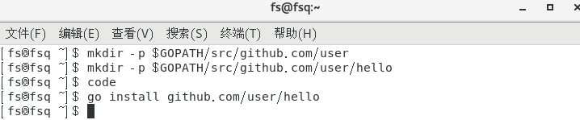

注：若在从包目录中运行 `go install`，也可以省略包路径：

```
$ cd $GOPATH/src/github.com/user/hello
$ go install
```

此命令会构建 `hello` 命令，产生一个可执行的二进制文件。 接着它会将该二进制文件作为 `hello`安装到工作空间的 `bin` 目录中。 在此为 `$GOPATH/bin/hello`。

`go` 工具只有在发生错误时才会打印输出，因此若这些命令没有产生输出， 就表明执行成功了。

现在，在命令行下输入它的路径来运行它：

```
$ $GOPATH/bin/hello
Hello, world.
```

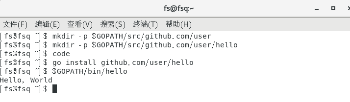

### 编写第一个库

第一步还是选择包路径（我们将使用 `github.com/user/stringutil`） 并创建包目录：

```
$ mkdir $GOPATH/src/github.com/user/stringutil
```

接着，在该目录中创建名为 `reverse.go` 的文件，内容如下：

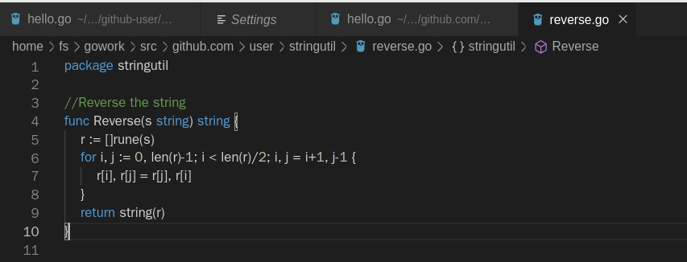

现在用 `go build` 命令来测试该包的编译：

```
$ go build github.com/user/stringutil
```

当然，若你在该包的源码目录中，只需执行：

```
$ go build
```

这不会产生输出文件。想要输出的话，必须使用 `go install` 命令，它会将包的对象放到工作空间的 `pkg` 目录中。

确认 `stringutil` 包构建完毕后，修改原来的 `hello.go` 文件去使用它：

```go
package main

import (
	"fmt"

	"github.com/user/stringutil"
)

func main() {
	fmt.Printf(stringutil.Reverse("!oG ,olleH"))
}
```

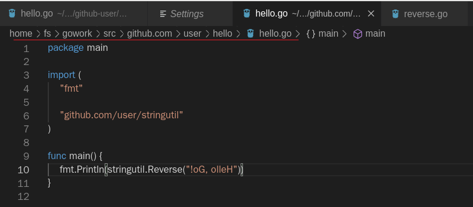

无论是安装包还是二进制文件，`go` 工具都会安装它所依赖的任何东西。 因此当我们通过

```
$ go install github.com/user/hello
```

来安装 `hello` 程序时，`stringutil` 包也会被自动安装。

运行此程序的新版本，我们应该能看到一条新的，反向的信息：

```
$ hello
Hello, Go!
```

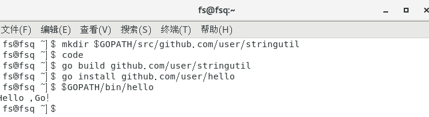

## 测试

Go拥有一个轻量级的测试框架，它由 `go test` 命令和 `testing` 包构成。

我们可以通过创建一个名字以 `_test.go` 结尾的，包含名为 `TestXXX` 且签名为 `func (t *testing.T)` 函数的文件来编写测试。 测试框架会运行每一个这样的函数；若该函数调用了像 `t.Error` 或 `t.Fail` 这样表示失败的函数，此测试即表示失败。

我们可通过创建文件 `$GOPATH/src/github.com/user/stringutil/reverse_test.go` 来为 `stringutil` 添加测试，其内容如下：

```go
package stringutil

import "testing"

func TestReverse(t *testing.T) {
	cases := []struct {
		in, want string
	}{
		{"Hello, world", "dlrow ,olleH"},
		{"Hello, 世界", "界世 ,olleH"},
		{"", ""},
	}
	for _, c := range cases {
		got := Reverse(c.in)
		if got != c.want {
			t.Errorf("Reverse(%q) == %q, want %q", c.in, got, c.want)
		}
	}
}
```

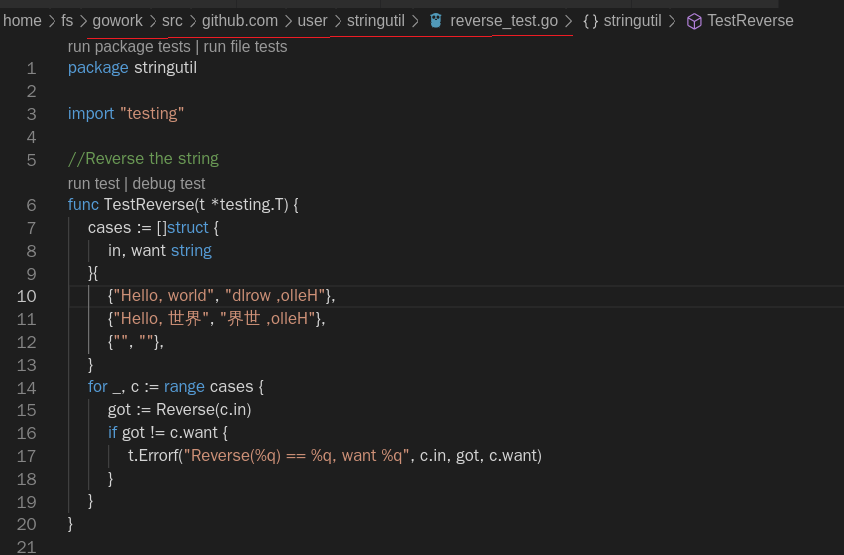

接着使用 `go test` 运行该测试：

```
$ go test github.com/user/stringutil
```

同样，若你在包目录下运行 `go` 工具，也可以忽略包路径

```
$ go test
```

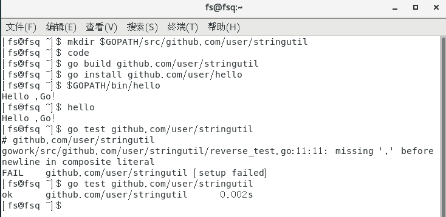

## 远程包

#### 实验指导

像Git或Mercurial这样的版本控制系统，可根据导入路径的描述来获取包源代码。`go` 工具可通过此特性来从远程代码库自动获取包。例如，本文档中描述的例子也可存放到Google Code上的Mercurial仓库 `code.google.com/p/go.example` 中，若你在包的导入路径中包含了代码仓库的URL，`go get` 就会自动地获取、 构建并安装它：

```
$ go get github.com/golang/example/hello
$ $GOPATH/bin/hello
Hello, Go examples!
```

若指定的包不在工作空间中，`go get` 就会将会将它放到 `GOPATH` 指定的第一个工作空间内。（若该包已存在，`go get` 就会跳过远程获取， 其行为与 `go install` 相同）

`hello` 命令及其依赖的 `stringutil` 包都托管在Google Code上的同一代码库中。`hello.go` 文件使用了同样的导入路径约定， 因此 `go get` 命令也能够定位并安装其依赖包。

```
import "github.com/golang/example/stringutil"
```

#### 实践操作

现在我们已经在github上注册了一个账号：Passenger0，同时新建了一个仓库：ServiceComputing。利用git我们将上面创建的两个文件夹hello和stringutil加上一个README.md文件传输到该仓库（具体操作见博客https://blog.csdn.net/Excef/article/details/100847614）

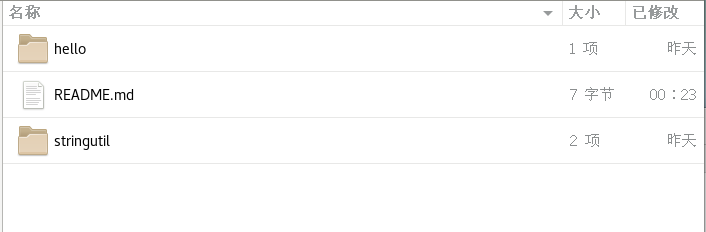

此时为了避免混淆将已存在的 $GOPATH/bin/hello文件重命名为hello2

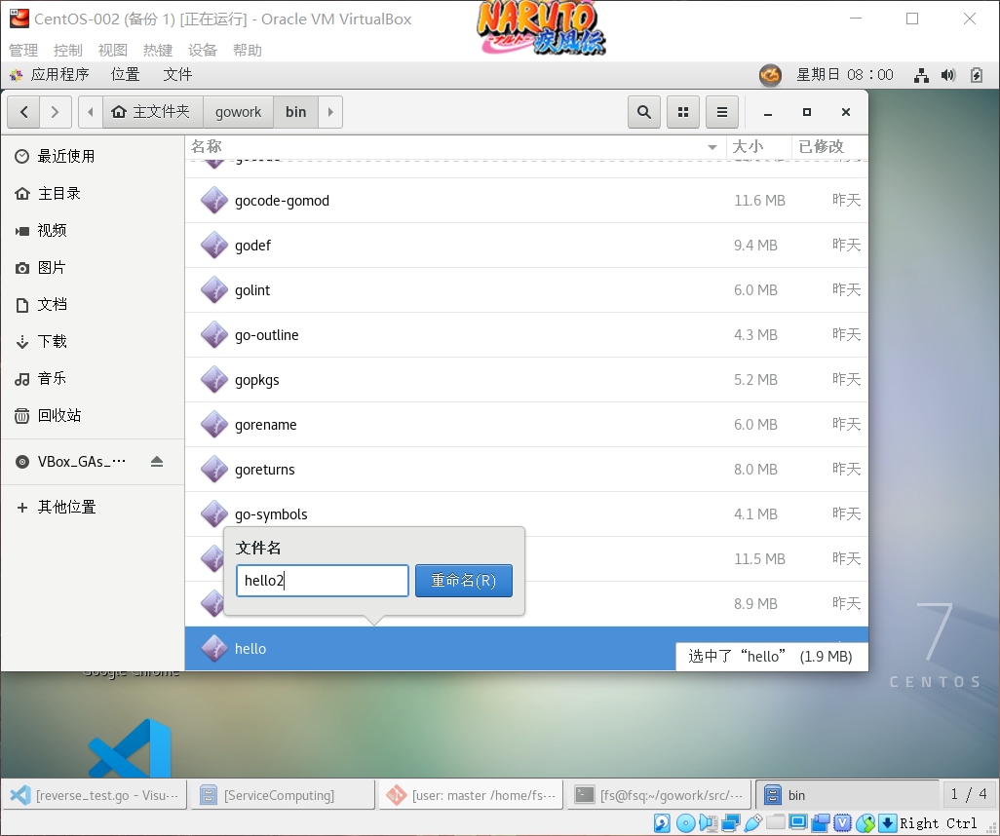

再调用如下语句

$ go get github.com/Passenger0/ServiceComputing/hello

此时系统就会新建一个$GOPATH/github.com/Passenger0/ServiceComputing文件夹并将远程仓库的文件拉取到这里

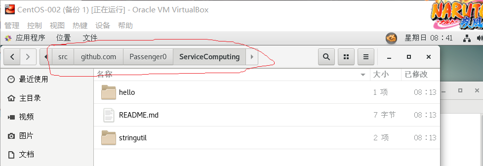

运行hello的二进制文件（由于原先的hello文件已被重命名，所以调用的是从远程仓库获取的hello.go的二进制文件）

$GOPATH/bin/hello

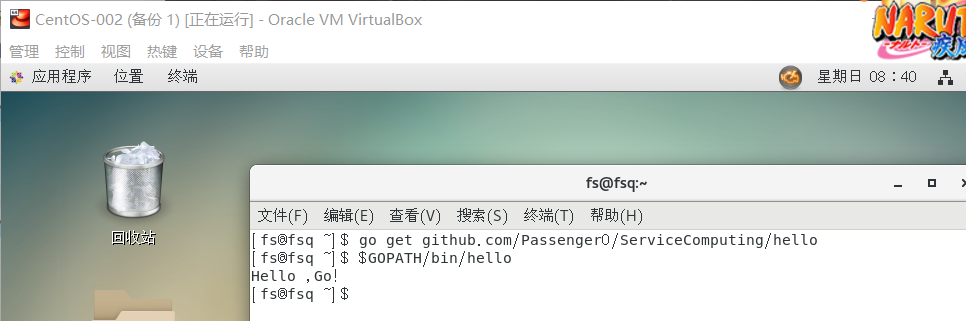

可知输出正确
