# CLI 命令行实用程序开发基础

### 1、概述

  CLI（Command Line Interface）实用程序是Linux下应用开发的基础。正确的编写命令行程序让应用与操作系统融为一体，通过shell或script使得应用获得最大的灵活性与开发效率。Linux提供了cat、ls、copy等命令与操作系统交互；go语言提供一组实用程序完成从编码、编译、库管理、产品发布全过程支持；容器服务如docker、k8s提供了大量实用程序支撑云服务的开发、部署、监控、访问等管理任务；git、npm等都是大家比较熟悉的工具。尽管操作系统与应用系统服务可视化、图形化，但在开发领域，CLI在编程、调试、运维、管理中提供了图形化程序不可替代的灵活性与效率。

### 2、实验内容

使用 golang 开发 [开发 Linux 命令行实用程序](https://www.ibm.com/developerworks/cn/linux/shell/clutil/index.html) 中的 **selpg**

提示：

1. 请按文档 **使用 selpg** 章节要求测试你的程序
2. 请使用 pflag 替代 goflag 以满足 Unix 命令行规范， 参考：[Golang之使用Flag和Pflag](https://o-my-chenjian.com/2017/09/20/Using-Flag-And-Pflag-With-Golang/)
3. golang 文件读写、读环境变量，请自己查 os 包
4. “-dXXX” 实现，请自己查 `os/exec` 库，例如案例 [Command](https://godoc.org/os/exec#example-Command)，管理子进程的标准输入和输出通常使用 `io.Pipe`，具体案例见 [Pipe](

### 3、设计说明

1. 首先，引入pflag（程序中将其重命名为了flag）并定义一个结构体存储seplg所有可能用到的命令。

   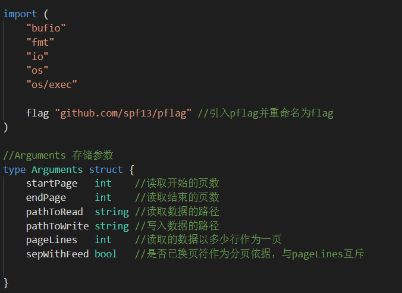

2. 程序运行后利用pflag对命令行输入进行解析获取需要的参数。

   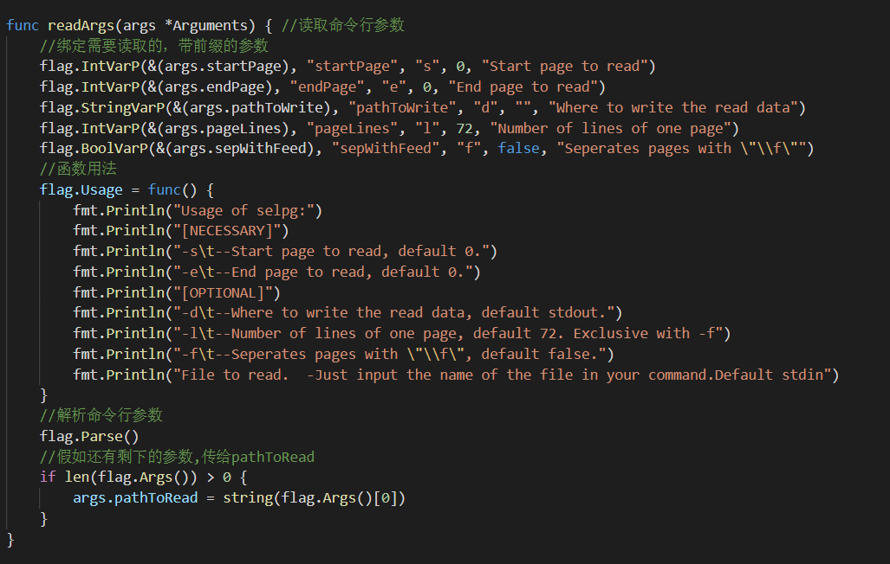

3. 获取参数后检查其是否合理，不合理则报错退出。

   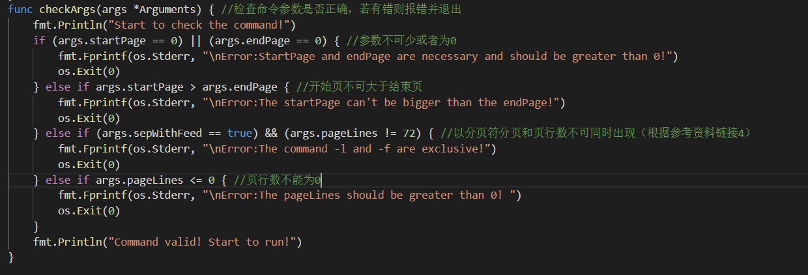

4. 参数合理后开始执行命令。

   先确定读取数据的位置，如果不是标准输出则需要打开该路径。

   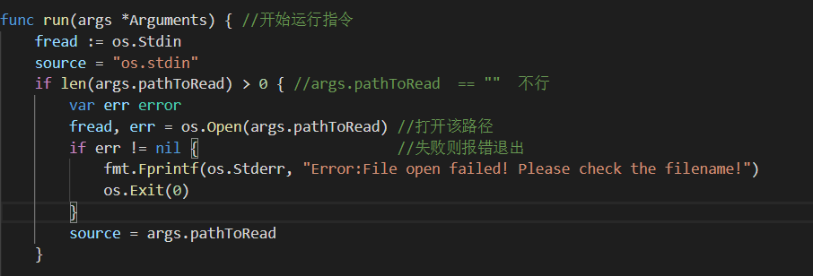

   之后根据输出路径进行数据的读取和输出

   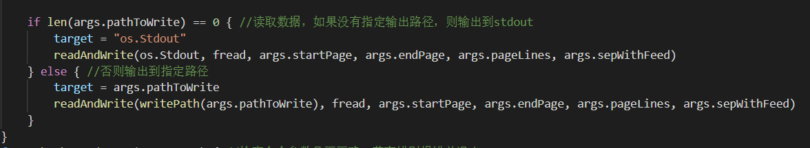

5. 读取并输出数据。

   首先需要根据是否按分页符分页确定每次读取一页数据还是读取一行数据，每次读取后判断是否为目标位置数据，是则输出并继续读取直至文件末尾。

   ```go
   func readAndWrite(fwrite interface{}, fread *os.File, start int, end int, lines int, feed bool) {
   	pageCount := 0                   //所读的页所在的页数
   	lineCount := 0                   //当前页所读的行数
   	buffer := bufio.NewReader(fread) //存储已读取数据的缓冲区
   
   	var aline, apage string //读取的一行/页数据
   	var err error           //检测是否出错
   	fmt.Println("We have read:")
   	if feed { //如果是按照“\f”分页读取
   		for true {
   			apage, err = buffer.ReadString('\f')            //每次读一页
   			pageCount++                                     //更新页数
   			if (pageCount >= start) && (pageCount <= end) { //判断是否可写
   				write(fwrite, apage)
   			}
   			if err == io.EOF || pageCount > end { //先写入文件再判断是否为文件末尾，避免最后一页或者一行因EOF而无法写入。
   				break
   			}
   		}
   	} else {
   		pageCount = 1 //第一次读确定为第一页
   		for true {
   			aline, err = buffer.ReadString('\n')
   			lineCount++            //每次读行数加一
   			if lineCount > lines { //行数超过一页的行数，则行数归一，页数加一
   				pageCount++
   				lineCount = 1
   			}
   			if (pageCount >= start) && (pageCount <= end) { //判断是否可写
   				write(fwrite, aline)
   			}
   			if err == io.EOF || pageCount > end {
   				break
   			}
   		}
   	}
   
   	if pageCount < start { //假如文件页数不够开始写
   		checkError(err, "StartPage greater than the number of total pages!Nothing to write! ")
   	} else if pageCount < end { //假如文件页数达不到所要写的页数
   		checkError(err, "EndtPage greater than the number of total pages!Incomplete read and write!")
   	}
   
   	//fmt.Printf("\nWriting complete!\nSource: %s\t\t\tTarget:%s",source,target)
   }
   
   ```

### 4、测试结果

首先需要安装pflag

```go
go get github.com/spf13/pflag
go install github.com/spf13/pflag
```

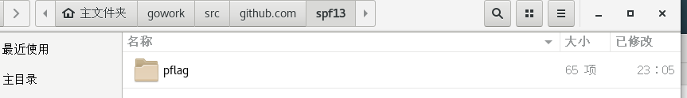

进入selpg文件夹并运行go build编译程序，然后开始测试。

1. ./selpg  -s1 -e1  test.txt 会将测试文件test.txt中第一页的内容读取到标准输出。为了方便debug，程序还增加了一些输出信息，最后再程序完成时删去了大多数，但还是i留下了两句

2. ./selpg  -s1 -e2  test.txt 会将测试文件test.txt中第一页和第二页的内容读取到标准输出。但是此文件只有一页，所以程序只会将第一页的内容输出然后报错

   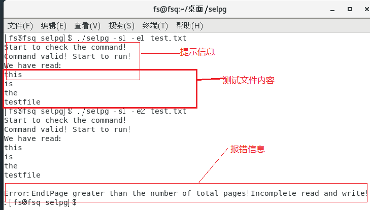

3. ./selpg  -s  1 -e  1  test.txt  >dest.txt  会将测试文件的第一页的内容复制到dest.txt。

   注意-s, -e等的参数可不紧挨着其前缀.

   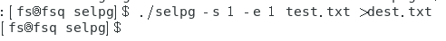

   此时打开dest.txt文件查看内容,程序输出的所有信息都写入了此文件(包含提示信息,可在程序中删除):

   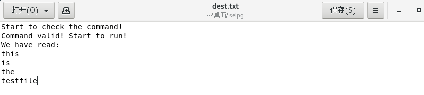

4. ./selpg  -s  2 -e  5  littlePrince.txt  >dest.txt.为了让测试效果明显,我们换了一个较大的测试文件,将其第二页到第五页复制到dest.txt.

   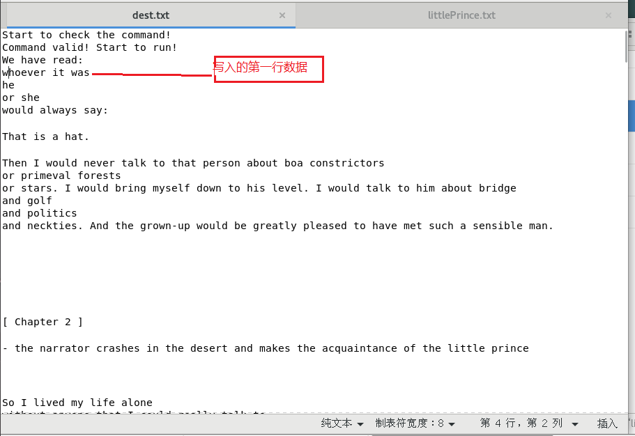

   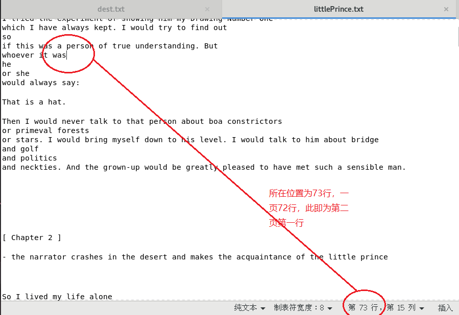

   对比后可知dest.txt(除开提示信息所)写入的第一行数据即为littlePrince.txt的第二页第一行数据

5. de1

### 5、参考资料

1. <https://pmlpml.github.io/ServiceComputingOnCloud/ex-cli-basic>
2. <https://blog.csdn.net/chenbaoke/article/details/42556949>
3. <https://blog.csdn.net/PeanutDo1t/article/details/83020872>
4. <https://www.ibm.com/developerworks/cn/linux/shell/clutil/index.html>
5. <https://blog.csdn.net/liuyh73/article/details/83025189>
6. <https://blog.csdn.net/weixin_34195364/article/details/88728991>

