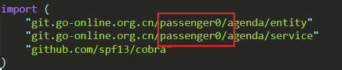

go语言简版agenda，在GoOnline上的版本。

博客地址：<https://blog.csdn.net/Excef/article/details/102791016>

GoOnlie项目地址： http://139.9.57.167:20080/share/bmrucau76kvt6d9qr9dg?secret=false

由于GoOnline的工作环境较为不同，所以需要将代码中与路径有关的部分中的“passenger0”换成你的用户名，如：

